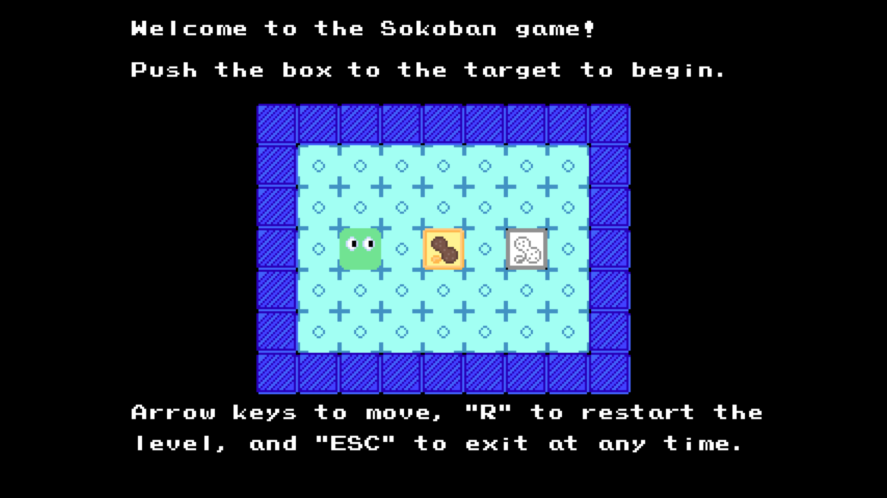
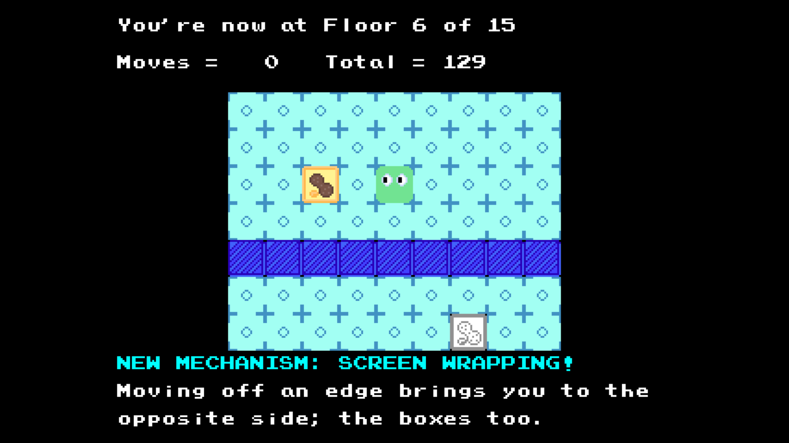

# VB.NET Sokoban Game Using `vbPixelGameEngine`



## Overview

This is a modern implementation of the classic Sokoban puzzle game, developed with VB.NET and the `vbPixelGameEngine`. This mini-game project offers multiple levels of increasing complexity, a screen wrapping mechanism, and refined audio-visual feedback.

The background music and sound effects are sourced from *The Tower of Druaga* and several other old-school video games. Moreover, the level design data is stored in a YAML file, and it is placed in the "Assets" folder, along with the game sprites and audio files.

Last but not least, all the in-game graphics are meticulously hand-crafted using Aseprite.

## Features

- **15 Challenging Levels**: Each level has unique designs and gameplay mechanisms, providing a progressive challenge for players.
- **Screen Wrapping**: Players can move through the edges of the screen and reappear on the opposite side, adding an interesting gameplay dynamic.
- **Polished Visuals**: The game features directional player sprites, enhancing the overall visual appeal.
- **Immersive Audio**: With background music and sound effects, players can enjoy an immersive gaming experience.
- **Complete Game Flow**: The game includes a tutorial, the main gameplay, and a victory sequence, ensuring a well - rounded gaming experience.
- **Reset Functionality**: Players can restart levels at any time, allowing them to try different strategies.
- **Move Counter**: Tracks the number of moves per level and the total number of moves, adding a competitive element to the game.



## Game Controls

| Key | Action |
|-----|--------|
| Arrow keys | Move the player |
| R | Reset the current level |
| ESC | Exit the game |

## Getting Started

### Prerequisites
- .NET SDK 8.0 or higher
- NuGet packages included in project references:
  - System.Drawing.Common 9.0.0+
  - YamlDotNet 16.3.0
  - NAudio 2.2.1

### Installation
```bash
git clone https://github.com/Pac-Dessert1436/VBPGE-Sokoban-Game.git
cd VBPGE-Sokoban-Game
```

### Running the Game
You can open the solution in Visual Studio and run the project. Alternatively, you can compile the game using the following commands:
```bash
msbuild "VBPGE Sokoban Game.sln"
./bin/Debug/net9.0/"VBPGE Sokoban Game.exe"
```

## Special Thanks

- [@DualBrain](https://github.com/DualBrain) for the [vbPixelGameEngine](https://github.com/DualBrain/vbPixelGameEngine)
- The composers of classic games for providing audio inspiration
- The Aseprite team for the excellent pixel art tool

## Contributing

Contributions are highly welcome! If you find any bugs, have ideas for performance improvements, or want to add additional features, please open an issue or submit a pull request.

## License

This project is licensed under the MIT License. Please refer to the [LICENSE](LICENSE) file for detailed information.
